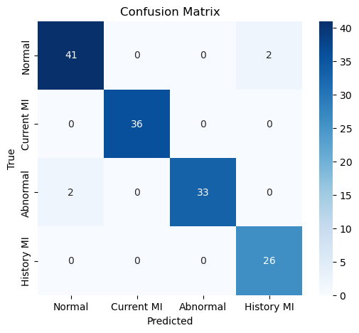
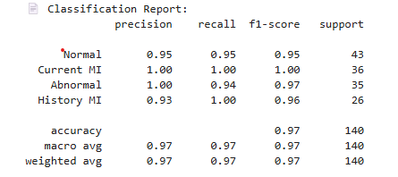

# ECG Cardiopathy Classification: Direct vs Cascade Learning

This repository implements a comparative study between a standard Multiclass CNN and a **3-Stage Cascade CNN** for electrocardiogram (ECG) image classification.

## 🔬 Research Context
Traditional CNNs often struggle with fine-grained differences between clinically similar cardiac conditions. Our approach uses a **staged refinement strategy** that mimics clinical diagnostic reasoning, progressively identifying pathologies from simple to complex.

## 📸 Dataset Samples
Here is an example of a processed ECG image used for training:

*Figure 1: Sample of Myocardial Infarction ECG used in this study.*

## 🚀 Key Results
The results demonstrate that the Cascade strategy significantly outperforms the direct multiclass approach.

- **Direct Multiclass CNN:** 92.0% Accuracy
- **Cascade CNN (Ours):** ✨ **97.1% Accuracy** ✨

### 📊 Evaluation Metrics
The model shows high precision and recall across all classes, especially in distinguishing between "History of MI" and "Current MI", which is a common challenge in cardiac AI.

#### Confusion Matrix

#### Classification Report

## 🛠️ Methodologies
Our proposed **Cascade Learning** strategy is divided into three stages:
1. **Stage 1 (Binary):** Distinguishing between **Normal** vs. **Pathological** cases.
2. **Stage 2 (3-Class):** Refinement into **Normal**, **Current MI**, and **Others**.
3. **Stage 3 (Final 4-Class):** Full classification including **Abnormal Heartbeat** and **History of MI** using weights transfer.

## 📂 Project Structure
- `models/`: CNN architecture definition (TensorFlow/Keras).
- `data/`: Image preprocessing and loading utilities.
- `notebooks/`: 
  - `1_Direct_Multiclass.ipynb`: Baseline model implementation.
  - `2_Cascade_Method.ipynb`: Our proposed 3-stage refined model.

## 🎓 Citation
If you use this work in your research, please cite our IEEE paper:
> **S. M. Kaddour**, M. L. Benomar, A. M. Oumer. "Cascade Convolutional Neural Networks Learning for ECG Cardiopathy Classification." ICCSDA, IEEE, 2025.
